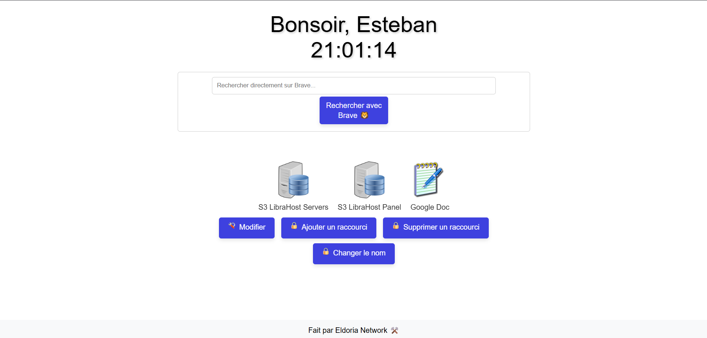
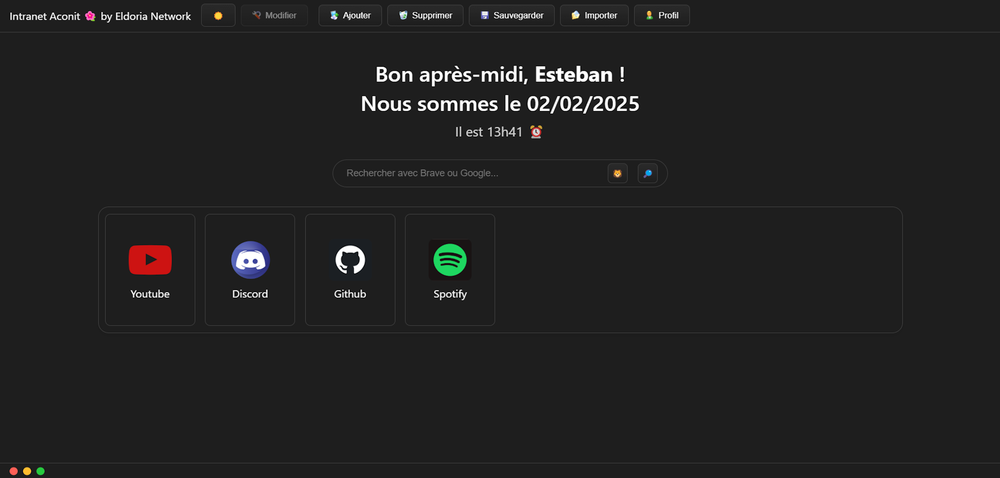

# Intranet Aconit ✨

Ce projet est une plateforme Intranet moderne, initialement conçue pour une personne âgée souhaitant un accès rapide et intuitif à ses sites Web favoris. L'interface a évolué pour offrir une expérience utilisateur plus raffinée et adaptable à un usage personnel ou professionnel.

## Nouveautés de l'Interface 🔄

La nouvelle version de l'interface s'inspire du design épuré et moderne d'Apple, avec une apparence sombre et soignée. Elle offre une organisation optimale pour une utilisation en environnement professionnel.

## Fonctionnalités Améliorées 🚀

- **Ajout de raccourcis personnalisés** : Créez des accès directs vers vos sites Web préférés.
- **Suppression de raccourcis** : Gérez facilement vos raccourcis.
- **Modification du nom d'utilisateur** : Adaptez l'interface à votre identité.
- **Affichage dynamique** : Heure actuelle et message de bienvenue personnalisé.
- **Sauvegarde et importation de raccourcis** : Gérez vos configurations de manière flexible.
- **Mot de passe protégé** : Un mot de passe par défaut "intra123?", modifiable dans `script.js`, est hashé grâce à `crypto-js`.
- **Mode sombre 🌌** : Une interface soignée, élégante et optimisée pour le confort visuel.
- **Thèmes secrets 🤫** : Des thèmes sont cachés dans le code de Aconit.

## Utilisation 🔧

### Ajouter un raccourci :
- Cliquez sur le bouton "Ajouter un raccourci".
- Entrez les informations suivantes :
  - URL du site Web
  - Nom de l'icône (facultatif)
  - URL de l'icône (facultatif)
  - Titre (facultatif)
- Validez pour afficher le raccourci sous forme d'icône.

### Suppression d'un raccourci :
- Cliquez sur "Supprimer un raccourci" et cliquez sur celui à supprimer.

### Personnalisation :
- Modifiez le nom d'utilisateur avec "Changer le nom".

### Gestion des raccourcis :
- Sauvegardez et importez vos raccourcis avec les options prévues.

### Sécurité :
- Un mot de passe par défaut "intra123?" est présent et modifiable dans `script.js`. Ce mot de passe est hashé à l'aide de `crypto-js`.

## Installation 🛠️

1. Téléchargez tous les fichiers et placez-les dans un dossier.
2. Ouvrez votre navigateur et tapez le chemin d'accès au fichier HTML. Par exemple : `file:///C:/Users/Intranet%20Aconit/Intranet.html`. Adaptez l'URL à votre système d'exploitation.
3. Compatible avec FireFox, Chrome, Opera, etc.

## Auteur 👨‍💻

Ce projet a été développé par **Esteban** dans le cadre d'une initiative visant à simplifier l'accès aux sites Web pour des utilisateurs ayant des besoins spécifiques.

## Contribution et Crédits 🤝

Les contributions sont les bienvenues ! Merci de me créditer en cas de modification ou d'amélioration du projet. Pour toute suggestion, veuillez ouvrir une issue.

## Licence 🔖

Ce projet est sous licence MIT. Voir le fichier [LICENSE](LICENSE) pour plus de détails.

